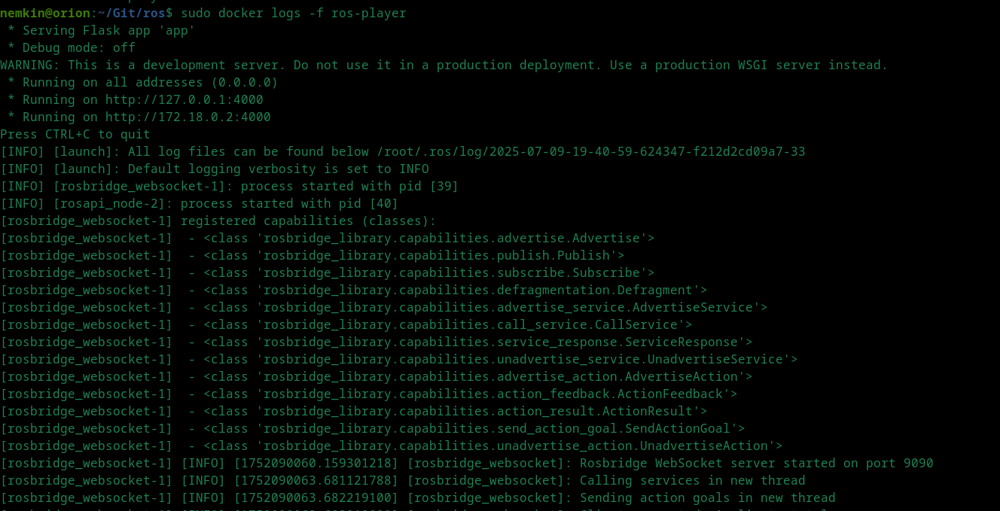
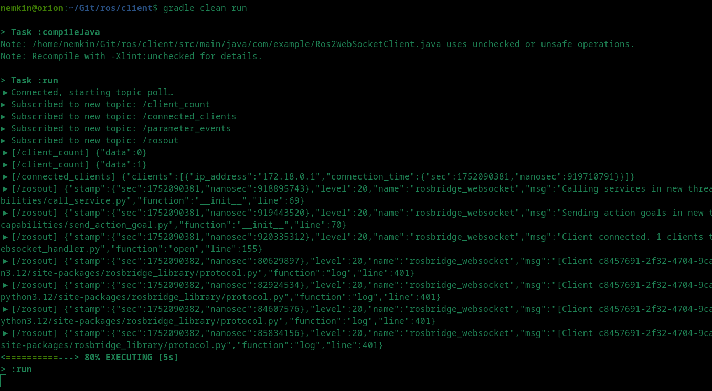
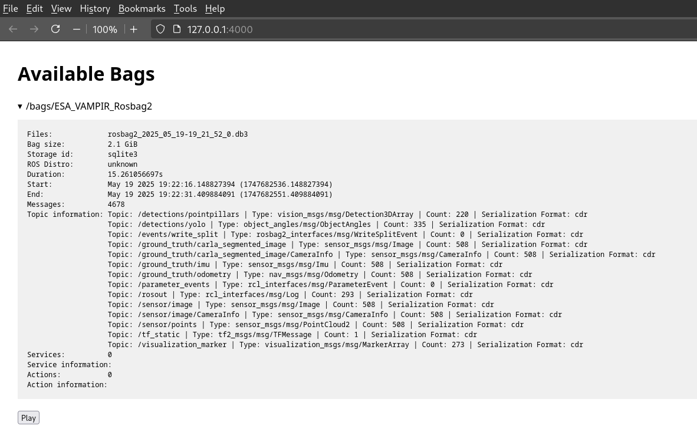
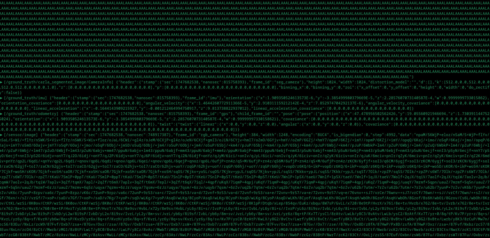

# ros-player

1. Copy bag data under `./bags`:
```
./bags/ESA_VAMPIR_Rosbag2/rosbag2_2025_05_19-19_21_52_0.db3
./bags/ESA_VAMPIR_Rosbag2/metadata.yaml
```

2. Run server with `sudo docker-compose up -d`, see server logs in Docker Desktop or with `sudo docker logs -f ros-player`.


3. Run client with `gradle clean run`.


4. Go to `http://127.0.0.1:4000/`, pick bag, press Play.


5. Client should pick up on new topics in the bag and print.

